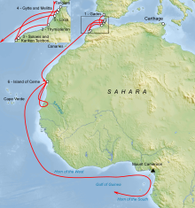

# method of notifying a telegram bot of new event 
eia - rss feed will make this easy
opec + -has an rss

they all had rss lolol


g

### first test code 

```python
import feedparser
from telegram import InlineKeyboardButton, InlineKeyboardMarkup
from telegram.ext import Updater, CommandHandler, CallbackQueryHandler, JobQueue

# Define your Telegram Bot token
TOKEN = 'your_telegram_bot_token'

# Define the sources you want to track
rss_feeds = {
    'Site 1': 'https://example.com/feed',
    'Site 2': 'https://example2.com/feed'
}

# Function to fetch and send updates from RSS feeds
def send_updates(context):
    for source, feed_url in rss_feeds.items():
        feed = feedparser.parse(feed_url)
        if not feed.entries:
            continue
        latest_entry = feed.entries[0]
        message = f"<b>{source}</b>\n\n{latest_entry.title}\n\nRead more: {latest_entry.link}"
        context.bot.send_message(chat_id=context.job.context, text=message, parse_mode='HTML')

# Command handler to start the bot
def start(update, context):
    update.message.reply_text("Bot is running!")

# Command handler to manually check for updates
def check(update, context):
    send_updates(context)

# Command handler to view past RSS posts
def past_posts(update, context):
    # Fetch and send past posts from RSS feeds
    for source, feed_url in rss_feeds.items():
        feed = feedparser.parse(feed_url)
        if not feed.entries:
            continue
        message = f"<b>{source} Past Posts:</b>\n\n"
        for entry in feed.entries:
            message += f"{entry.title}\nRead more: {entry.link}\n\n"
        context.bot.send_message(chat_id=update.effective_chat.id, text=message, parse_mode='HTML')

# Initialize the bot and updater
updater = Updater(token=TOKEN, use_context=True)
dispatcher = updater.dispatcher
job_queue = updater.job_queue

# Register command handlers
dispatcher.add_handler(CommandHandler("start", start))
dispatcher.add_handler(CommandHandler("check", check))
dispatcher.add_handler(CommandHandler("pastposts", past_posts))

# Schedule periodic updates
job_queue.run_repeating(send_updates, interval= 3600, first=0, context=CHAT_ID)

# Start the bot
updater.start_polling()
updater.idle()
 ```


	•	python-telegram-bot version 13.7
	•	feedparser version 6.0.8

   
   
   
#  what shall the name be ?


### Hanno 

 an ancient Carthaginian explorer who lived around the 5th century BCE. He is known for his famous voyage along the western coast of Africa, possibly reaching as far as modern-day Sierra Leone. As a navigator and explorer, 



  _his route may not be correct as to not give the location to other traders._


  