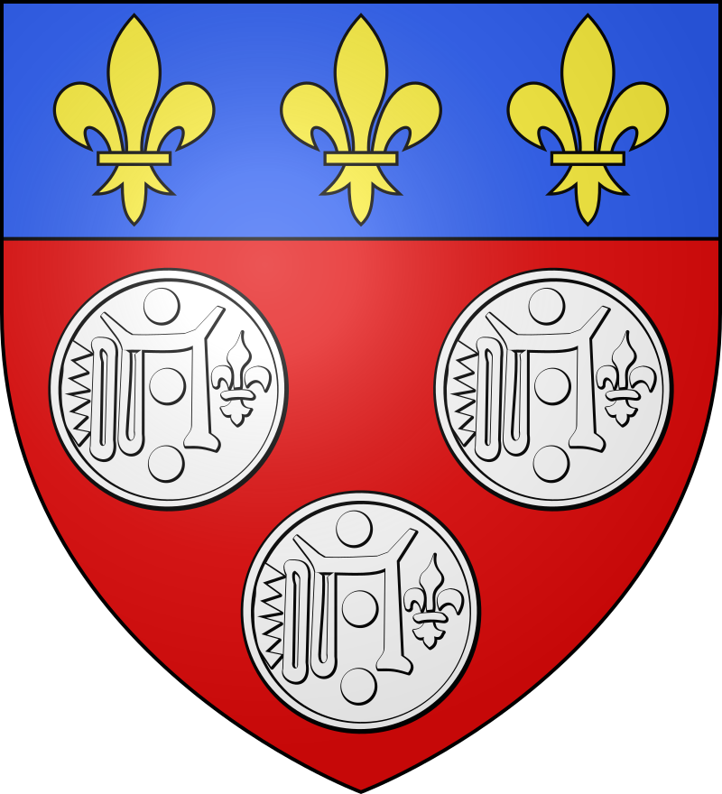

# project Chartres 

orderbook heatmap on telegram . 

# deep blue sea  
i have found opensource code. my style is doing it from scratch, but itd good to know i have a back up plan. my bot should be up and working by tommoeow. id be able to test faster if i post on my own rssfeed . 
p

after this is up ill pipe in eallets with rss3 finish project chartes and begin web3 tv with content from my telegram. 

this can oly go well :) 

