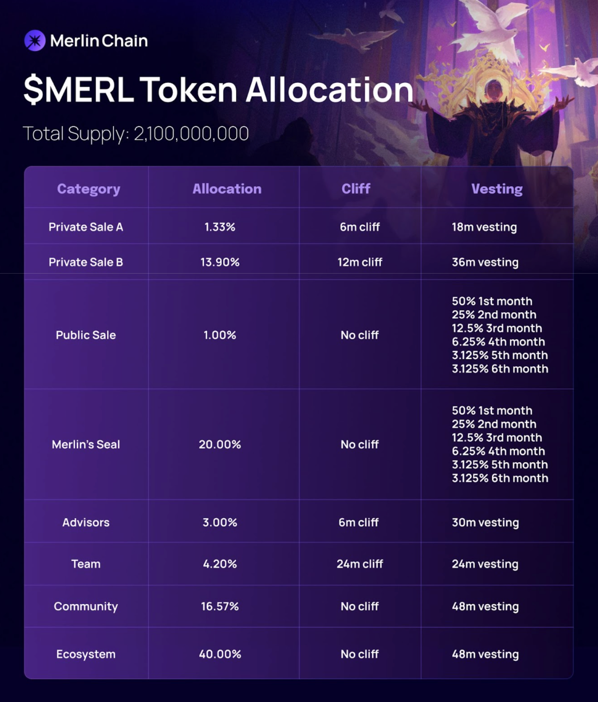

# project Chartres 

overwhelming .... i found this https://github.com/Elenchev/order-book-heatmap/tree/main maybe i can bust it fown to rebuild 

# deep blue ocean 

i waisted months on this project. not saying the easiest route odd the best but i definitely should have tried the easier route first. my idea was too created my own from scratch. 500 code pilot promots i cashed for an open source boy that works great. all i need  now is to create a feed watcher for wallets or sites that don’t use rss. 

#### major lesson 

get that shit working ASAP AS FAST AS POSIBBLE 

# WEB3Tv 

yo yo yo , man this feels good, a few more rss feeds and we are in there like swimwear. naw but really. 

# topics gor episode one
hyperliquid L1 - fist  blockchain made for  perp trading?
its built with *tendermint* On the arbitrum L2. Created in 2014, Tendermint is a blockchain protocol used to replicate and launch blockchain applications across machines in a secure and consistent manner. It is the brainchild of blockchain software architect Jae Kwon and internet biophysicist Ethan Buchman. 

### why is hyperliquid special? 
it includes a lot of new assets. 
it will have a layer -1 with all fees paid in the hyperliquid token 
funding rates are the lowest in the industry (shouts out to rage trade perp comparasion) 
interesting order types like twap or scale. 

bullish on $purr but till when. what meme coin isnt named purr ???

### $merl
two words 

_btc L2_ 

lets cut to brass tax shall we 
Merlin Chain is a native Bitcoin Layer2 that is committed to empowering Bitcoin's native assets, protocols, and products on Layer1 through its Layer2 network to Make Bitcoin Fun Again. Merlin Chain integrates the ZK-Rollup network, decentralized oracle network, and on-chain BTC fraud-proof modules. Merlin Chain has locked over 3.5 billion TVL within 30 days after its mainnet launch. The team behind Merlin, Bitmap Tech, is a premier OG team boasting an overall market cap exceeding $500 million. The BRC-420 "Blue Box" collection under Bitmap Tech has become one of the hottest assets on Ordinals.

### other 
possible airdrops from the cross cain narative 
 Nexus Bridge (Hyperlane) for bridging assets like Injective and Ethereum, LiquidSwap & Lumio (Pontem) using LayerZero Tech for bridging to networks like Aptos, and deBridge for most EVM chains and Solana. XSwap, powered by Chainlink’s CCIP, offers swaps across EVM chains with a point system for users. Squid Router covers nearly all EVM chains, and Bungee Exchange utilizes Socket Protocol for cross-chain messaging. Focus on focusing on transaction count, frequency, and volume to maximize potential airdrop benefits 

Founders And CEO Of Cryptocurrency Mixing Service Samoourai Arrested And Charged With Money Laundering And Unlicensed Money Transmitting Offenses of over 2 billion dollars 

#### *sources*
https://learn.bybit.com/blockchain/tendermint/

🙄 https://medium.com/@venturevisionary/hyperliquid-research-report-1c50f2c33dce

https://medium.com/@merlinchaincrypto