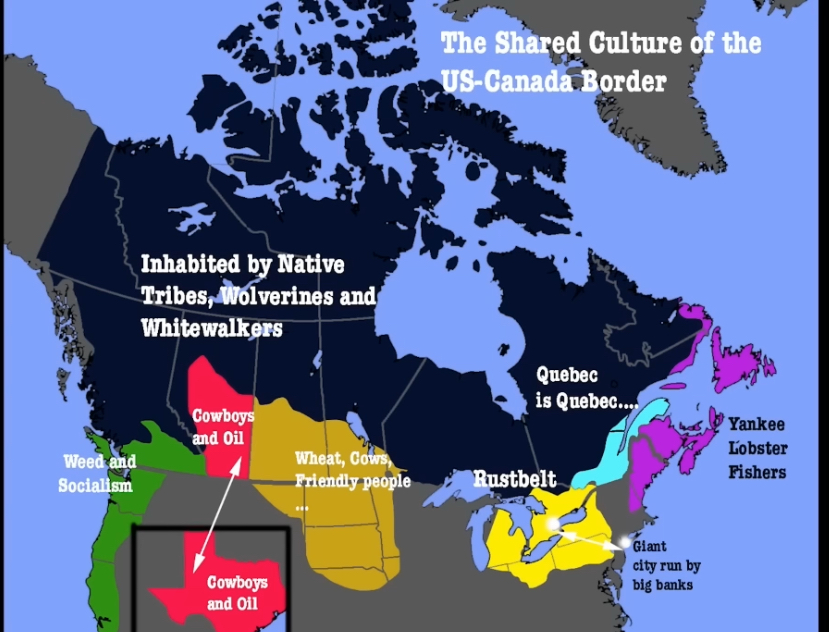

 today i worked on quite alot.  Unfortunately i didn’t get much done. i  learneda lot about Canada, they have a “slash” of 20ft of defirested land between the U.S. Canada border. it cost every US citizen .75 cents per year to maintain. every 5-15 years an agency deforests it. They also have odd egyptian guidestones . COOL! 

 

Politics wise i found this map. Quebec has always been more french and more left. they have been close to succeeding from Canada multiple times. 

i believe if my memory doesn’t mistake me, the war of 1812 was a united states  Canadian war. Us lost we have been chill.  i think loss than 20% of Canadians speak French. 

-- my not progress

i had a super hard time creating the image file, I’m going to go on fiver to fet this done 

still adding rss feeds. im not using any from my original list. 

looking to add web scraping features as well as message forwarding with filters, hyperliquid data, amd finally an eventual wallet tracker. My idea for the wallet tracker is either paying for  API access or scraping new it X or Etherscan. I have been getting super bothered the nocturnal  adjunct is not working,  a comprehensive breakdown off  the bot is well in order. I am positive the image iverlay comands are broke, the kek comand is broke, and possibly more. The money command did work, wiggle and the starting prompt. the random messages worked as well. finally on my telegram section i think i will definitely separate the rss reader and scraper. the reader is done by a pro. Its super confusing, which sounds ironic. why can’t people just code on one file. 

timelines!!! 
docker fix may 10
message forward 3
scraper - 7

i really need to get this shiii done so i can do efficient research,  today when i was doing research i learned founding us documents are almost impossible to find. somehow ensed up on the deparrment of state sote and found some anti russia pro-semite garbage. i truly believe founding fathers are turning in their graves. what do i know. i might have found a published version but  itsays edited. there are claims it’s headers and footnotes, but if that was the case for 90% of the pages nobody would  call the editor a liar for omitting 10 %. I want all the letters. Here soon i have to overcome the hurdle of learning how to add PDFs to the site because i hsve recently been smashing books. Sometimes while talking to ai. I read 1/2 of “The bond book”  but one night ib saw i could upload it to got 4 and i felt like the learning curve was increased  immensely,  