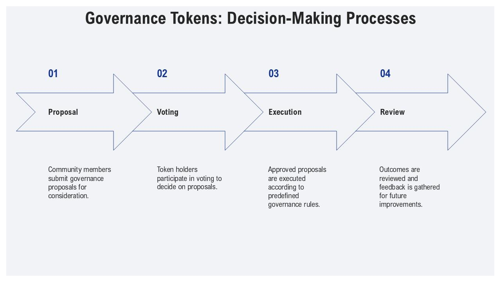

<h1>What is Hyperspeed</h1>

Project Hyperspeed is a web scraper primarily for governance proposals. It filters for names (e.g., Wintermute and other top trading firms like Paradigm) and content traction.

 

<h2>Why Does It Even Matter?</h2>

The whole idea of protocols controlled by everyone fascinates me. It is the inclusivity that fascinates me. Most know about my fascination with ERC404. I love the fungibility, the accessibility. I digress. Governance democratized to this standard is extremely slow. This provides several weeks for investors to bet on the outcomes of currencies based on proposed protocol improvement proposals.

<h2>How Long Does This Process Normally Take?</h2>

 

<em>It depends</em>. All governance protocols are different, but it takes at least 2 weeks for a proposal to gain any traction. Speed is important to prohibit frontrunners like us, but at the same time, there is a give and take by allowing all users participating in governance to vote. A historically massive problem with these governance structures is the lack of participation by the users. So adequate time is needed to allow the few users who do care the time to vote. This code will send alerts through Telegram to ensure rapid notice by the user.

<h4>As always, this code will be made free on my website for you to use as well.</h4>

<ol>
<li>Ethena</li>
<li>Arbitrum</li>
<li>Uniswap</li>
<li>MakerDAO</li>
<li>Aave</li>
<li>Avax</li>
<li>Compound</li>
<li>Curve</li>
</ol>

<h4>Sources</h4>

<ul>
<li><a href="https://gov.ethenafoundation.com/">Ethena</a></li>
<li><a href="https://forum.arbitrum.foundation/">Arbitrum</a></li>
<li><a href="https://gov.uniswap.org/">Uniswap</a></li>
<li><a href="https://vote.makerdao.com/">MakerDAO</a></li>
<li><a href="https://governance.aave.com/">Aave</a></li>
<li><a href="https://forum.avax.network/">Avax</a></li>
<li><a href="https://www.comp.xyz/">Compound</a></li>
<li><a href="https://gov.curve.fi/">Curve</a></li>
</ul>
